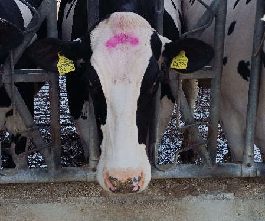
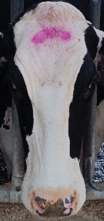
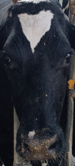
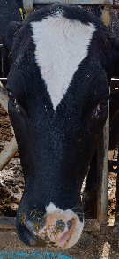
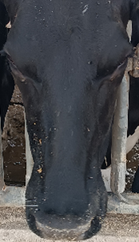
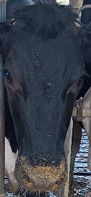
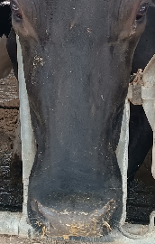
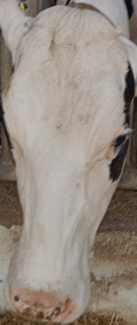
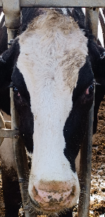
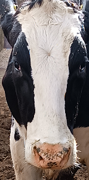

# CattleSSFR (cattle single sample face recognition) dataset 
A total of 311 unique cattle face images were collected using a Xiaomi Note 11S (108 MP camera). All images were captured in a farm in northern Greece while the animals were in the feeding trough and eating. The latter was so that their heads would be positioned as straight as possible and their movement would be limited. Fig.1(a) illustrates an original image as captured before being preprocessed.
All original images were manually cropped to retain only facial regions (Fig.1(b)), in order to remove background noise and reduce variability not related to the identification task. Thus, it is ensured that the models will focus on the discriminative features of each cattle’s face. 
The set of 311 cropped single cattle face images comprises the CattleSSFR dataset, which is publicly available. CattleSSFR is the first reported dataset for SSFR containing 311 classes of cattle faces single images. Indicative images from CattleSSFR dataset are illustrated in Fig.2, aiming to demonstrate the diversity of different classes for the problem under study and the challenges related to the SSFR problem, e.g., facial features covered in mud, head movements, and environmental noise.

<p align="center">
  
  
</p>
<p align="center">
  <em>Fig. 1. Indicative data preparation : (a) Original captured image, (b) Cropped image from CattleSSFR dataset.</em>
</p>

<p align="center">
  
  
  
  
  
  
  
  

</p>
<p align="center">
  <em>Fig. 2. Indicative images from CattleSSFR dataset demonstrating different single image cattle face classes .</em>
</p>

If you use this dataset, please cite it as follows:
```bibtex
@inproceedings{dede2026single,
  title     = {Single Sample Cattle Face Recognition},
  author    = {S. Dede, E. Vrochidou, V. Kanakaris, G. A. Papakostas},
  booktitle = {Proceedings of the 6th Symposium on Pattern Recognition and Applications (SPRA 2026)},
  address   = {Osaka, Japan},
  year      = {2026}
}
```
